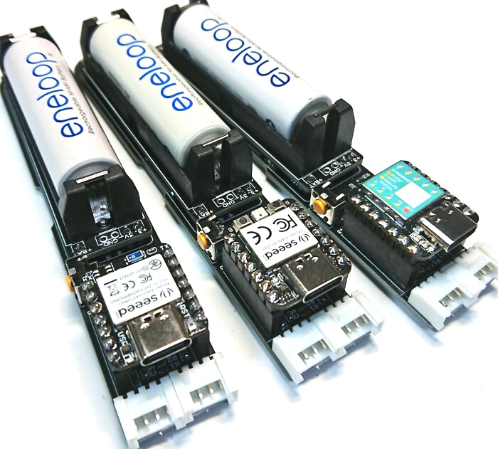
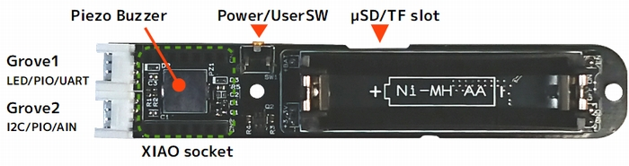

# XIAO WAND

## Overview

XIAO WANDはSeeedstudioの小型MCUモジュール "XIAO" シリーズ専用のI/O・電源ベースボードです。  
W20mm×L115mm×H22mmのコンパクトサイズに、高出力・高効率の電源モジュール"[ENEBATT](https://osafune.github.io/enebatt_jp.html)"を搭載しており、単三形ニッケル水素電池1本でGroveセンサーモジュールやLEDテープの制御が可能です。  
専用のArduino IDE用ライブラリ「xiaowand_lib」では、ボードの電源制御およびボタンイベント取得、LEDパターン点滅、MMLバックグランド再生の機能が提供され、XIAO BLEと組み合わせれば簡単にBluetooth制御の電飾ユニットが製作できます。

- ボード搭載ペリフェラル
	* 電源モジュール×1 (Ni-MH AA,最大3.3V/1000mA)
	* タクタイルスイッチ×1 (電源ボタン・ユーザーボタン兼用)
	* Groveコネクタ×2 (LED/UART用×1, I2C/PIO/AIN用×1)
	* 圧電ブザー×1
	* μSD/TFカードスロット×1

- 対応ボード
	* [Seeeduino XIAO](https://wiki.seeedstudio.com/Seeeduino-XIAO/) ボードマネージャー 1.8.3以降
	* [XIAO RP2040](https://wiki.seeedstudio.com/XIAO-RP2040/) ボードマネージャー 2.7.2以降
	* [XIAO BLE(Sense)](https://wiki.seeedstudio.com/XIAO_BLE/) ボードマネージャー 1.0.0 または 2.6.1以降

- 外形サイズ
	* 幅20.5mm×長さ115mm×厚み22mm（電池および突起部含む）  
	固定用ネジ穴 φ3.1×2

## Board Layout
  

- **Power/UserSW**  
電源ON/OFFおよびユーザー入力（クリック、長押し）のタクタイルスイッチです。ステート制御は`xiaowand_lib`で行います。  

- **Grove1 (LED/PIO/UART)**  
NeoPixelテープ等を接続することを想定したコネクタです。ENEBATTからの直接出力で最大3.3V/1000mAを使うことができます。  

  |PIN|信号名|内容|
  |---|---|---|
  |1|D7/RXD|PIO_D7またはUART-RXD|
  |2|D6/TXD|PIO_D6またはUART-TXD|
  |3|VLED|ENEBATTからの3.3V出力|
  |4|GND|GND|

- **Grove2 (I2C/PIO/AIN)**  
センサーやスイッチ等を接続することを想定したコネクタです。XIAOモジュールの3.3Vで駆動され、USBが接続されている間は常に電源が供給されます。  

  |PIN|信号名|内容|
  |---|---|---|
  |1|D5/SCL|PIO_D5、I2C-SCLまたはAIN5|
  |2|D4/SDA|PIO_D4、I2C-SDAまたはAIN4|
  |3|3.3V|XIAOモジュールからの3.3V出力(max100mA)|
  |4|GND|GND|

  ※アナログ入力はXIAO RP2040では使えません  

- **Piezo Buzzer**  
オンボード搭載のピエゾブザーです。  

- **μSD/TF slot**  
microSD/TFカードを挿入するスロットです。XIAOモジュールの3.3Vで駆動され、USBが接続されている間は常に電源が供給されます。  

## Documents
- [XAIO WAND プログラミングガイド](xiaowand_programming_guide_jp.md)

## Resources
- [XIAO WAND ライブラリ(Arduino IDE用)](src/xiaowand_lib.ino)
- [回路図(Rev.B)](pcb/xiaowand_pcb_revb_schem.pdf)
- [ENEBATT](https://osafune.github.io/enebatt_jp.html)

## Buy now

準備中

## Contant Us
- [GitHub - Shun OSAFUNE](https://github.com/osafune)
- Sales - sales@j7system.jp
