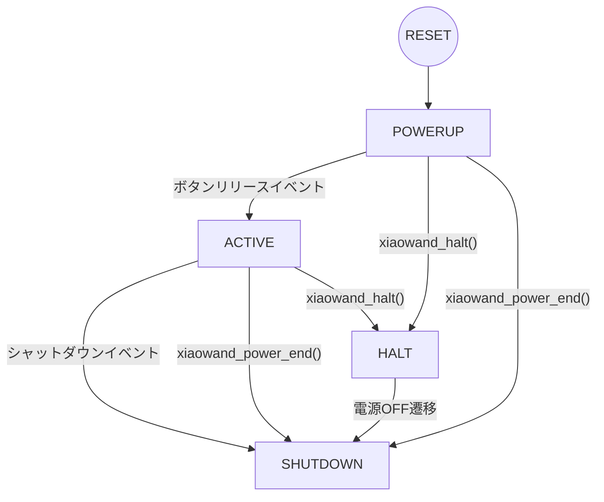

# XIAO WANDプログラミングガイド

***

## 1.簡単なサンプル例(XIAO BLEを使用)

### 基本的なフレームワーク

1. Arduino IDEで新しいスケッチを作成し、以下のコードを記述します。

```cpp :sample.ino
#define XIAOWAND_MODULE_XIAO_BLE

void setup() {
  xiaowand_power_begin();
  xiaowand_blink(1, 0);   // LED_BULTINをON
}

void loop() {
  xiaowand_polling();
}

void xiaowand_startup() {
  // ボタン長押しで起動した時に行う処理はここに書く
}

void xiaowand_loop() {
  // メインのloop()処理部分をここに書く
}

void xiaowand_shutdown() {
  // 電源OFFする時に必要な処理はここに書く
}
```

2. 作成したスケッチのフォルダに`xiaowand_lib.ino`ファイルをコピーします。  

3. コンパイルしてXIAO BLEに書き込みます。書き込みが完了後USBケーブルを抜いて電源ボタンを5秒以上長押しし、ボード上のLEDが消灯したらボタンを離します（電源OFF操作）。  
    
  ⚠️ USBケーブルが接続されている間は電源制御にかかわらずXIAOモジュールは電源が入った状態のままになります。センサー側のGroveおよびSDカードの電源も供給され続けます。  

4. 電源ボタンを押してボード上のLEDが点灯したらボタンを離します（電源ON操作）。  

5. 再度電源ボタンを5秒以上長押ししてボード上のLEDが消灯したらボタンを離します（電源OFF操作）。

  
### ボード上の圧電ブザーを使う

XIAO WANDの圧電ブザーは`D0`ピンに接続されています。音を鳴らす場合は`tone()`で指定します。ボードの圧電ブザーは`D0`ピンに接続されています。  
また、ライブラリのMMLサービスを使うとMMLで記述した楽譜を演奏することができます。  

```cpp :beep_sample.ino
#define XIAOWAND_MODULE_XIAO_BLE
#define BUZZER_PIN D0       // PIN_D0に圧電ブザー

void setup() {
  xiaowand_power_begin();
  xiaowand_blink(1, 0);     // LED_BULTINをON
}

void loop() {
  xiaowand_polling();
}

void xiaowand_startup() {
  // 長押し起動でメロディチャイムを再生
  xiaowand_mml_play("t84o5l8f+d<a>dea4.ef+e<a>d4.", false);
}

void xiaowand_loop() {
  if (xiaowand_check_click()) {
    tone(BUZZER_PIN, 1000, 100);	// クリックされたらbeep音
  }
}

void xiaowand_shutdown() {}
```

  
### ボード上のμSD/TFカードスロットを使う

XIAO WANDのμSD/TFカードスロットはSPI接続で使用することができます。カードのSSは`D2`ピンに接続されています。

```cpp :sd_sample.ino
#include <SD.h>
#define XIAOWAND_MODULE_XIAO_BLE
#define SD_SS_PIN D2        // PIN_D2にSDカードの/CS

File myfile;

void setup() {
  xiaowand_power_begin();
  xiaowand_blink(1, 0);     // LED_BULTINをON

  if (!SD.begin(SD_SS_PIN)) {
    xiaowand_blink(0x32, -1);
    xiaowand_halt();        // カードの初期化に失敗したらHALT
  }
  myfile = SD.open("testfile.bin", FILE_READ);
  if (!myfile) {
    xiaowand_blink(0x32, -1);
    xiaowand_halt();        // ファイルのオープンに失敗したらHALT
  }
}

void loop() {
  xiaowand_polling();
}

void xiaowand_startup() {}

void xiaowand_loop() {}

void xiaowand_shutdown() {
  if (myfile) myfile.close(); // シャットダウンの前にクローズする
}
```

  
### NeoPixelの制御をする

XIAO WANDのLED/UART側のGroveコネクタは3.3V/500mAの電源供給ができるため、NeoPixelモジュールを接続して電飾ユニットにすることができます。  
NeoPixelの駆動はソフトウェアリソースを多く使う都合上、MMLサービスを同時に使う場合には音の歪みやテンポの遅れが発生することがあります。  

```cpp :neopixel_sample.ino
#include <Adafruit_NeoPixel.h>
#define XIAOWAND_MODULE_XIAO_BLE
#define NEOPIXEL_PIN D6         // LED側GroveのD1ピン(D6/TXD)
//#define NEOPIXEL_PIN D7         // GroveのD0ピンを使うものもある
#define NEOPIXEL_LED_NUMBER 60  // 制御するLEDの個数 

// NeoPixelの表示（60個をレインボー表示）
Adafruit_NeoPixel strip = Adafruit_NeoPixel(
                              NEOPIXEL_LED_NUMBER,
                              NEOPIXEL_PIN,
                              NEO_GRB + NEO_KHZ800);
void rainbow(void) {
  static int firstPixelHue = 0;

  for (int i = 0; i < strip.numPixels(); i++) {
    int pixelHue = firstPixelHue + (i * 65536L / strip.numPixels());
    strip.setPixelColor(i, strip.gamma32(strip.ColorHSV(pixelHue)));
  }
  strip.show();

  firstPixelHue += 256;
  if (firstPixelHue >= 3 * 65536) firstPixelHue = 0;
}

void setup() {
  xiaowand_power_begin();
  xiaowand_blink(1, 0);  // LED_BULTINをON

  strip.begin();      // NeoPixel開始、この時全てのLEDは0に設定される
  strip.show();       // LEDへデータ転送し初期化する
}

void loop() {
  xiaowand_polling();
}

void xiaowand_startup() {
}

void xiaowand_loop() {
  rainbow();
  delay(10);
}

void xiaowand_shutdown() {
  strip.clear();  // シャットダウンイベントで全消灯する
  strip.show();
}
```

***
<br>

## 2.ライブラリリファレンス

### イベントハンドラ

電源制御ライブラリから明示的に呼び出されるイベントハンドラ関数です。以下の３つはスケッチの中に**必ず**記述しなければなりません。  

- **xiaowand_startup()**  
電源OFFから電源ボタン長押しで起動したときに一度だけ呼び出される関数です。  
ブートモードを切り替えたい場合（例：Bluetoothのペアリングモードに入る）に使用します。  
この関数を抜けるまでは`xiaowand_loop()`や`xiaowand_shutdown()`には制御が移りません。  

- **xiaowand_loop()**  
電源状態がアクティブの時に常に呼び出される関数です。  
電源ステートに応じた処理を行うため、通常のユーザープログラムコードは `loop()`の代わりにこの関数へ記述します。  

- **xiaowand_shutdown()**  
アクティブの状態から電源ボタン長押しでシャットダウンイベントが発生したときに、電源がカットされる前に一度だけ呼び出される関数です。  
ファイルシステムなどの電源を切る前に開放が必要なリソースの処理や、電源OFFを明示的に処理する必要がある場合に使用します。電源ボタンが離されるまでは電源ONの状態になるため、例えばNeoPixelのLEDテープやI2C接続のディスプレイモジュールの消灯処理などはここで行います。  
この関数を抜けるまでは電源ONが維持されます。また、この関数に処理が移った時点で`SHUTDOWN`ステートに移行し、以後どのイベントも発生しません。


### XIAOモジュール識別マクロ

XIAO WANDに搭載されているモジュールの識別用のマクロで、スケッチの先頭にXIAOにあわせて一つだけ記述します。

```cpp
// XIAO BLEまたはXIAO BLE Senseを搭載している場合
#define XIAOWAND_MODULE_XIAO_BLE
```
```cpp
// XIAO RP2040を搭載している場合
#define XIAOWAND_MODULE_XIAO_RP2040
```
```cpp
// Seeeduino XIAOを搭載している場合（インターバルタイマーはTC3を使用）
#define XIAOWAND_MODULE_XIAO
```
```cpp
// Seeeduino XIAOを搭載していて、インターバルタイマーにTCC0使う場合
#define XIAOWAND_MODULE_XIAO_USE_TCC0
```


### 電源ステート遷移とイベント

XIAO WAND電源コントロールの内部ステート遷移は以下のようになっています。



- **POWERUPステート**  
ボード電源コントロールをイネーブルにしてから最初のボタンリリースイベント発生、あるいは`HALT`、`SHUTDOWN`への明示的な遷移が行われるまでの状態です。  
このステートではボタン押下イベント、ボタンリリースイベント、スタートアップイベントが発生します。  
- **ACTIVEステート**  
通常の動作をしている状態です。シャットダウンイベント発生、あるいは`HALT`、`SHUTDOWN`への明示的な遷移が行われるまでの状態です。  
このステートではボタン押下イベント、ボタンリリースイベント、シャットダウンイベント、ボタン長押しイベント、クリックイベントが発生します。
- **HALTステート**  
`xiaowand_halt()`でシステムを明示的に停止している状態です。ボタン長押しによる電源OFF遷移でのみ`SHUTDOWN`に遷移します。  
このステートではいかなるイベントも発生しません。  
- **SHUTDOWNステート**  
ボード電源コントロールをディセーブルにし、電源OFFを待機している状態です。  

またそれぞれのステートとボタン操作に応じて以下の6つのイベントが発生します。  

1. ボタン押下イベント  
内部ステートが`HALT`以外のときにボタンが押された場合に発生します。  
0. ボタンリリースイベント  
内部ステートが`HALT`以外のときにボタンが離された場合に発生します。  
`POWERUP`ステートでこのイベントが発生すると`ACTIVE`ステートに遷移します。  
0. スタートアップイベント  
`POWERUP`ステートのときに5秒以上ボタンが押されたままになっていると１回だけ発生します。  
0. シャットダウンイベント  
`ACTIVE`ステートのときに5秒以上ボタンが押されたままになっていると１回だけ発生します。その後は`SHUTDOWN`ステートに遷移します。  
0. ボタン長押しイベント  
`ACTIVE`ステートで2秒以上ボタンが押されたままになっていると発生します。操作上、シャットダウンイベントの前にも必ず発生することに注意してください。
0. ボタンクリックイベント  
`ACTIVE`ステートでボタンが押された時間が0.5秒以下のときに発生します。操作上、ボタンリリースイベントも同時に発生することに注意してください。

各イベントの発生時間は`xiaowand_lib.ino`の先頭部で宣言されている以下の値を書き換えて調整することができます。  

```cpp :xiaowand_lib.ino(抜粋)
// 定数
const int xiaowand_pswcount_max = 100;  // 長押し検出の最大時間(0.1秒単位で10秒まで)
const int xiaowand_startup_hold = 50;   // 電源ONから5秒間長押し(POWERUP)
const int xiaowand_shutdown_hold = 50;  // 5秒間長押しで電源OFF(SHUTDOWN)
const int xiaowand_longpush_hold = 20;  // 2秒で長押し検出(LONGPUSH)
const int xiaowand_click_hold = 5;      // 0.5秒以下でクリック検出(CLICK)
    :
    :
```

***
<br>

## 3.MMLリファレンス

### MMLについて

MML (Music Macro Language) は、音高、音長、音量、テンポなどを指定する一種の言語です。MMLサービスで音楽を演奏するときに使います。
アルファベットは大文字でも小文字でもかまいません。  

### MMLの使い方

- 音名(`A`,`B`,`C`,`D`,`E`,`F`,`G`)、半音(`+`,`#`,`-`)  
A～GはそれぞれA=ラ、B=シ、C=ド、D=レ、E=ミ、F=ファ、G=ソの音名に対応しています。  
A～Gの直後に半音を示す#、+(シャープ)、-(フラット)を付けることができます。また、後ろに整数(1～96)を付けて音長を設定することができます。  

- 休符(`R`)  
Rの後に、整数(1～96)を付けて休符の長さを設定することができます。

- 音長(`Ln`)  
nは1～96の整数で、1を全音符としてnの逆数が音の長さを表します。このコマンド以降は音長の指定がない音名、休符はここで指定した音長で演奏されます。

- 音長(ピリオド)  
付点音符は音名コマンドの最後にピリオドを追加することで表します。付点はその音長の1.5倍の長さになるため `A4.` とすると四分音符（音長4）の1.5倍になります。

- オクターブ(`On`,`<`,`>`)  
nは1～8までの整数です。基準周波数440Hzのラの音はオクターブ4(O4A)です。  
`>`を指定すると、現在演奏されている高さから１オクターブ上がり、`<`を指定すると１オクターブ下がった高さで演奏されます。

- テンポ(`Tn`)  
nは20～280の整数です。nは1分間に四分音符をn回数える速さです。

- 音量(`Vn`,`[`,`]`)  
そのパートの音量を指定します。nは0～15の整数で15が最大となります。また0ではそのパートの音は出力されません。  
`]`を指定すると、現在演奏されている音量から1つ大きくなり、`[`を指定すると1つ小さくなります。  
※このコマンドはxiaowand_mmlサービスでは無視されます。

- クオンタイズ(`Qn`)  
1音中の音の長さの割合を指定します。nは1～8で指定し、1が最短、8が最長になります。

- タイ(`&`)  
続けて演奏する音を繋ぎます。タイを指定した次のコマンドには同じ音名（または休符）を指定します。

- 繰り返し(`(`,`)n`)  
`()`でくくった中のMMLをn回繰り返して演奏します。nは2～9が指定でき、省略した場合は2を指定したものとみなされます。
また繰り返しは10個までネストすることができます。


### MML一覧表

|コマンド|機能|初期値|
|:---:|:---|:---:|
|A～G|音名||
|+,#|半音上げる(シャープ)||
|-|半音下げる(フラット)||
|R|休符||
|Ln|音長(1～96)|4|
|.(ピリオド)|音長を1.5倍にする||
|On|オクターブ(1～8)|5|
|<|1オクターブ下げる||
|>|1オクターブ上げる||
|Tn|テンポ(30～280)|120|
|Vn|音量(0～15)|8|
|[|音量を1つ下げる||
|]|音量を1つ上げる||
|Qn|1音中の音長の割合(1～8)|8|
|&|前後の音をつなぐ(タイ)||
|()n|n回繰り返す(2～9)|2|


***
<br>

## 4.APIリファレンス

### xiaowand_power_begin()

電源制御処理を初期化し、XIAO WANDの電源コントロールおよびMMLサービスを開始します。  
全てのイベントフラグおよびコールバックは初期化され、内部ステートは`POWERUP`に設定されます。この関数の実行までは電源ONの維持はされないため、通常は`setup()`の先頭に記述します。  
※この関数は`setup()`以外の場所では使うことができません。  

- 書式  
*void* xiaowand_power_begin(*void*)  

  - 引数  
  なし

  - 返値  
  なし

- 記述例  

```cpp
void setup() {
  xiaowand_power_begin();
    :
    :
}
```

---
### xiaowand_power_end()

XIAO WANDの電源コントロールおよびMMLサービスを終了し、電源をOFFにします。実際にボードの電源がカットされるのはボタンが離されたときになります。  
ボタン監視を停止し、LED・サウンド発生をOFFにして内部ステートは`SHUTDOWN`に設定されます。  
この関数はシャットダウンイベント発生時に内部で自動的に呼ばれるため、通常は使用する必要はありません。ソフトウェア的に電源OFFが必要な場合に使用します。  
また、この関数ではシャットダウンイベントは発生しません。リソースの開放等の処理は予め済ませておく必要があります。

- 書式  
*void* xiaowand_power_end(*void*)  

  - 引数  
  なし

  - 返値  
  なし

- 記述例  

```cpp
void foo() {
  // リソース開放等の処理
    :
    :
  xiaowand_power_end();
}
```

---
### xiaowand_halt()

XIAO WANDのイベント呼び出しを全て停止し、ボタン長押しによる電源OFFを待ちます。  
システム中で続行不可能な状態が発生した場合に、`while(1)`ループの代わりに使用します。  
内部ステートは`HALT`に設定され、以後全てのイベントは発生しなくなります。ボタン長押しで電源OFFを行ったときにもシャットダウンイベントは発生しません。リソースの開放等の処理は予め済ませておく必要があります。  
※この関数はイベントコールバックの中では使うことができません。  

- 書式  
*void* xiaowand_halt(*void*)  

  - 引数  
  なし

  - 返値  
  なし

- 記述例  

```cpp
void setup() {
  xiaowand_power_begin();
  xiaowand_blink(1, 0);   // LED_BULTINをON

  // SDカードの初期化に失敗したらHALT
  if (!SD.begin(XIAOWAND_SD_SS_PIN)) {
    xiaowand_blink(0x32, -1);	// LEDを点滅
    xiaowand_halt();
  }
}
```

---
### xiaowand_polling()

XAIO WANDの電源コントロールイベントやボタンの状態監視を行います。  
ステートの状態遷移やイベントの呼び出しを行うため、`loop()`の中に記述します。他ライブラリ等でポーリングを使用する場合はループ処理が最短になるよう注意してください。  
通常のユーザープログラムコードは`loop()`の代わりに`xiaowand_loop()`に記述します。  
※この関数は`loop()`以外の場所では使うことができません。  

- 書式  
*void* xiaowand_polling(*void*)  

  - 引数  
  なし

  - 返値  
  なし

- 記述例  

```cpp
void loop() {
  xiaowand_polling();
}

void xiaowand_loop() {
  // ユーザープログラムはこちら側に書く //
    :
    :
}
```

---
### xiaowand_blink()

XIAOモジュールのLED点滅パターンを設定します。  
点滅処理はメインの処理とは独立して行われ、いつでも点滅パターンや回数を指定することができます。  
デフォルトでは`LED_BULTIN`で指定されるLEDを使用します。また`xiaowand_attach_blink()`でON/OFF時のコールバックを指定して点滅を別のリソースに割り当てることができます。  

- 書式1  
*void* xiaowand_blink(*uint32_t* pattern, *int* cycle)  

  - 引数  
    * pattern  
    点滅パターンを指定します。パターンは最大4フィールドのON時間・OFF時間をそれぞれ4bitで表し、以下のフォーマットで記述します。  
	  `0x<ON時間1><OFF時間1><ON時間2><OFF時間2><ON時間3><OFF時間3><ON時間4><OFF時間4>`  
	  点滅パターンは`ON時間1→OFF時間1→ON時間2→‥‥→OFF時間4→ON時間1→`とループします。各時間は0.1秒単位で、それぞれ0(0x0)～15(0xF)の指定ができます。0を指定した場合はその部分はスキップされます。例えば、1秒周期のデューティー50%の点滅を指定するとき、`0x55`、`0x5500`、`0x550000`、`0x55000000`は同じ動作になります。  
      * 例１）ON時間が長めの点滅パターン   
      0x32 : 0.3秒ON→0.2秒OFF
      * 例２）2秒周期で2回点滅するパターン  
      0x11170a00 : 0.1秒ON→0.1秒OFF→0.1秒ON→0.7秒OFF→1秒OFF  
      * 例３）2回消灯して点灯で終わるパターン  
      0x01211000 : 0.1秒OFF→0.2秒ON→0.1秒OFF→0.1秒ON

    * cycle  
    点滅回数を指定します。1以上の整数、または-1を指定します。-1を指定した場合はループ動作になります。  
    0を指定した場合は書式2の即値ON/OFFになります。  

  - 返値  
  なし

- 書式2  
*void* xiaowand_blink(*uint32_t* led, 0)  

  - 引数  
	  * led  
	  LEDのON/OFFを指定します。`0`を指定した場合はLED消灯、`≠0`を指定した場合はLED点灯します。 

  - 返値  
  なし

- 記述例  

```cpp
void setup() {
  xiaowand_power_begin();
  xiaowand_blink(1, 0);   // LED_BULTINをON
}
    :
    :

void xiaowand_startup() {
  xiaowand_blink(0x11170a00, -1);	// 長押し起動で2回点滅パターンをループ
}

void xiaowand_loop() {
  if (xiaowand_check_click()) {
    xiaowand_blink(0x01211000, 1);	// クリックされたら１回点滅
  }
  if (xiaowand_check_longpush()) {
    tone(XIAOWAND_BUZZ_PIN, 1000, 100);	// 長押しされたらbeep音
  }
}
    :
    :
```

---
### xiaowand_is_active()

XIAO WANDの電源がアクティブかどうかを確認します。  
通常は`xiaowand_polling()`の中で適切に処理されるため不要ですが、スケジューラー等で別スレッドから電源状態を確認したい場合などに使用します。  

- 書式  
*bool* xiaowand_is_active(*void*)  

  - 引数  
  なし

  - 返値  
  内部ステートが`ACTIVE`の時に`true`、それ以外の場合の時には`false`を返します。

---
### xiaowand_check_press()

ボタンの押下イベントが発生したかどうかを確認します。  
この関数が呼ばれるとボタン押下のイベント発生フラグはクリアされます。

- 書式  
*bool* xiaowand_check_press(*void*)  

  - 引数  
  なし

  - 返値  
  この関数が呼ばれるまでに押下イベントがあれば`true`、なければ`false`を返します。  

---
### xiaowand_check_release()

ボタンのリリースイベントが発生したかどうかを確認します。  
この関数が呼ばれるとボタンリリースのイベント発生フラグはクリアされます。

- 書式  
*bool* xiaowand_check_release(*void*)  

  - 引数  
  なし

  - 返値  
  この関数が呼ばれるまでにリリースイベントがあれば`true`、なければ`false`を返します。  

---
### xiaowand_check_longpush()

ボタンの長押しイベントが発生したかどうかを確認します。  
操作上、長押しイベントはシャットダウンイベントの前に必ず発生することに注意してください。  
この関数が呼ばれると長押しのイベント発生フラグはクリアされます。

- 書式  
*bool* xiaowand_check_longpush(*void*)  

  - 引数  
  なし

  - 返値  
  この関数が呼ばれるまでに長押しイベントがあれば`true`、なければ`false`を返します。  

---
### xiaowand_check_click()

ボタンのクリックイベントが発生したかどうかを確認します。  
この関数が呼ばれると長押しのイベント発生フラグはクリアされます。

- 書式  
*bool* xiaowand_check_click(*void*)  

  - 引数  
  なし

  - 返値  
  この関数が呼ばれるまでにクリックイベントがあれば`true`、なければ`false`を返します。  

---
### xiaowand_check_blink()

`xaiowand_blink()`で設定される点滅パターンが動作しているかどうかを確認します。

- 書式  
*bool* xiaowand_check_blink(*void*)  

  - 引数  
  なし

  - 返値  
  点滅パターンが動作していれば`true`、停止していれば`false`を返します。  

---
### xiaowand_is_eventcb()

現在の関数がイベントコールバックで呼び出されているかどうかを確認します。

- 書式  
*bool* xiaowand_is_eventcb(*void*)  

  - 引数  
  なし

  - 返値  
  イベントコールバックで呼び出されている時に`true`、それ以外の場合の時には`false`を返します。

---
### xiaowand_attach_startup()

スタートアップイベントで呼び出されるコールバックを登録します。  
コールバックは割り込みハンドラやタスクスケジューラ内から呼ばれるため、使えるリソースに制限があることに注意してください。

- 書式  
*void* xiaowand_attach_startup(_void (*cb_func)(void)_)  

  - 引数  
    * cb_func  
    イベントで呼び出される関数を指定します。`NULL`を指定した場合はコールバックを解除します。  

  - 返値  
  なし

- 記述例  

```cpp
void setup() {
    :
    :
  xiaowand_attach_startup(on_startup);
}

void on_startup(void) {
    :
    :
}
```

---
### xiaowand_attach_shutdown()

シャットダウンイベントで呼び出されるコールバックを登録します。  
コールバックは割り込みハンドラやタスクスケジューラ内から呼ばれるため、使えるリソースに制限があることに注意してください。  

- 書式  
*void* xiaowand_attach_shutdown(_void (*cb_func)(void)_)  

  - 引数  
    * cb_func  
    イベントで呼び出される関数を指定します。`NULL`を指定した場合はコールバックを解除します。  

  - 返値  
  なし

- 記述例  

```cpp
void setup() {
    :
    :
  xiaowand_attach_shutdown(on_shutdown);
}

void on_shutdown(void) {
    :
    :
}
```

---
### xiaowand_attach_press()

ボタン押下イベントで呼び出されるコールバックを登録します。  
コールバックは割り込みハンドラやタスクスケジューラ内から呼ばれるため、使えるリソースに制限があることに注意してください。

- 書式  
*void* xiaowand_attach_press(_void (*cb_func)(void)_)  

  - 引数  
    * cb_func  
    イベントで呼び出される関数を指定します。`NULL`を指定した場合はコールバックを解除します。  

  - 返値  
  なし

- 記述例  

```cpp
void setup() {
    :
    :
  xiaowand_attach_press(count_press);
}

int count_press_value = 0;  // ボタンが押された数をカウント
void count_press(void) {
  count_press_value++;
}
```

---
### xiaowand_attach_release()

ボタンリリースイベントで呼び出されるコールバックを登録します。  
コールバックは割り込みハンドラやタスクスケジューラ内から呼ばれるため、使えるリソースに制限があることに注意してください。

- 書式  
*void* xiaowand_attach_release(_void (*cb_func)(void)_)  

  - 引数  
    * cb_func  
    イベントで呼び出される関数を指定します。`NULL`を指定した場合はコールバックを解除します。  

  - 返値  
  なし

- 記述例  

```cpp
void setup() {
    :
    :
  xiaowand_attach_release(count_release);
}

int count_release_value = 0;  // ボタンが離された数をカウント
void count_release(void) {
  count_release_value++;
}
```

---
### xiaowand_attach_longpush()

長押しイベントで呼び出されるコールバックを登録します。  
コールバックは割り込みハンドラやタスクスケジューラ内から呼ばれるため、使えるリソースに制限があることに注意してください。  

- 書式  
*void* xiaowand_attach_longpush(_void (*cb_func)(void)_)  

  - 引数  
    * cb_func  
    イベントで呼び出される関数を指定します。`NULL`を指定した場合はコールバックを解除します。  

  - 返値  
  なし

- 記述例  

```cpp
void setup() {
    :
    :
  xiaowand_attach_longpush(on_longpush);
}

void on_longpush(void) {
    :
    :
}
```

---
### xiaowand_attach_click()

クリックイベントで呼び出されるコールバックを登録します。  
コールバックは割り込みハンドラやタスクスケジューラ内から呼ばれるため、使えるリソースに制限があることに注意してください。  

- 書式  
*void* xiaowand_attach_click(_void (*cb_func)(void)_)  

  - 引数  
    * cb_func  
    イベントで呼び出される関数を指定します。`NULL`を指定した場合はコールバックを解除します。  

  - 返値  
  なし

- 記述例  

```cpp
void setup() {
    :
    :
  xiaowand_attach_click(on_click);
}

void on_click(void) {
    :
    :
}
```

---
### xiaowand_attach_blink()

`xaiowand_blink()`で設定される点滅パターンでONおよびOFFの時に呼び出されるコールバックを登録します。
コールバックは割り込みハンドラやタスクスケジューラ内から呼ばれるため、使えるリソースに制限があることに注意してください。  

- 書式  
*void* xiaowand_attach_click(_void (*cb_on_func)(void)_, _void (*cb_off_func)(void)_)  

  - 引数  
    * cb_on_func  
    点滅ONで呼び出される関数を指定します。`NULL`を指定した場合はコールバックを解除します。  
    * cb_off_func  
    点滅OFFで呼び出される関数を指定します。`NULL`を指定した場合はコールバックを解除します。  

  - 返値  
  なし

- 記述例  

```cpp
void setup() {
    :
    :
  pinMode(LEDB, OUTPUT);
  pinMode(LEDR, OUTPUT);
  xiaowand_attach_blink(led_blue, led_red);
}

// LED ONで青色LED点灯 
void led_blue() {
  digitalWrite(LEDB, LOW);
  digitalWrite(LEDR, HIGH);
}

// LED OFFで赤色LED点灯 
void led_red() {
  digitalWrite(LEDB, HIGH);
  digitalWrite(LEDR, LOW);
}
```

--- 
### xiaowand_mml_play()

MMLの演奏をリクエストします。既に別のMMLを演奏中の場合は新しく演奏を開始します。  
MMLサービスは通常バックグランドで処理されているため、演奏が終了したかどうかを確認するには`xiaowand_is_mmlplay()`、エラー情報の取得は`xiaowand_mml_status()`を使用します。  
演奏できるMMLの仕様についてはMMLリファレンスを参照してください。  

- 書式  
*void* xiaowand_mml_play(_const char *_ mml_str, _const bool_ loop)  

  - 引数  
    * mml_str  
    演奏をするMML文字列または文字列のポインタを指定します。  
    MML文字列は演奏中にMMLサービス側から常に参照されるため、**静的な変数または即値で指定**しなければなりません。  
    * loop  
    MMLをループ演奏するかどうかを指定します。`true`でループ演奏、`false`で１回演奏となります。  

  - 返値  
  なし  

- 記述例  

```cpp
void xiaowand_loop() {
  // クリックされたらLEDを点滅させてメロディチャイムを演奏 
  if (xiaowand_check_click()) {
    xiaowand_blink(0x01211000, 1);
    xiaowand_mml_play("t84o5l8f+d<a>dea4.ef+e<a>d4.", false);
  }
}
```

--- 
### xiaowand_mml_stop()

MMLの停止をリクエストします。MMLが演奏中でない場合は何もしません。  

- 書式  
*void* xiaowand_mml_stop(*void*)  

  - 引数  
  なし

  - 返値  
  なし  

- 記述例  

```cpp
void xiaowand_loop() {
  // クリックされたらLEDを点滅させてループ演奏
  if (xiaowand_check_click()) {
    xiaowand_blink(0x01211000, 1);
    xiaowand_mml_play(mml_town, true);
  }

  // 長押しされたら演奏をストップ
  if (xiaowand_check_longpush()) {
    xiaowand_blink(0x01100000, 1);
    xiaowand_mml_stop();
  }
}
```

---
### xiaowand_is_mmlplay()

MMLが再生中かどうかを確認します。

- 書式  
*bool* xiaowand_is_mmlplay(*void*)  

  - 引数  
  なし

  - 返値  
  MMLが再生中の時に`true`、それ以外の場合の時には`false`を返します。

- 記述例  

```cpp
void xiaowand_loop() {
  // クリックされたら演奏開始
  if (xiaowand_check_click()) {
    xiaowand_mml_play(mml_town, false);
  }

  // 演奏中はLEDを点滅
  if (xiaowand_is_mmlplay() && !xiaowand_check_blink()) {
    xiaowand_blink(0x01117000, 1);
  }
}
```

---
### xiaowand_mml_status()

MMLサービスで発生したエラーコードと文字列中の位置を取得します。  

- 書式  
*void* xiaowand_mml_status(_int *_ err_code, _int *_ err_pos)  

  - 引数  
    * err_code  
    発生したエラーコードを格納する変数のポインタを指定します。  
    
    |値|内部定義ラベル|説明|
    |---|---|---|
    |0|MML_OK|エラー発生なし|
    |-1|SYNTAX_ERROR|文法エラー|
    |-2|OUT_OF_RANGE|コマンドが指定できる範囲を超えている|
    |-3|LOOP_OVERFLOW|ループの入れ子数が範囲を超えている|
    |-4|LOOP_UNDERFLOW|閉じられているないループが存在する|

    * err_pos  
    エラーが発生したMML文字中の位置を格納する変数のポインタを指定します。  
    `err_code`が`0`の場合は無効な値になります。  

  - 返値  
  なし  

- 記述例  

```cpp
void print_mml_error(const char *mml) {
  int err_code, err_pos;
  xiaowand_mml_status(&err_code, &err_pos);

  switch(err_code) {
    case 0:
      return;
    case -1:
      Serial.println("[!] MML Syntax error.");
      break;
    case -2:
      Serial.println("[!] Parameter out of range.");
      break;
    case -3:
      Serial.println("[!] Too many nested loops.");
      break;
    case -4:
      Serial.println("[!] No corresponding loop.");
      break;
    default:
      Serial.println("[!] Unknown error.");
  }

  Serial.print(" MML : ");
  Serial.println(mml);
  for(int i = 1; i < err_pos+7; i++) Serial.write(" ");
  Serial.println("^");
}
```

***
<a id="section5"></a><br>

## 5.更新履歴

|Rev|日付|内容|
|---|---|---|
|0.95|2023/09/09|内部ステート名を変更|
|0.94|2023/06/13|xiaowand_check_startup() および xiaowand_check_shutdown() を削除|
|0.93|2023/04/07|公開|
